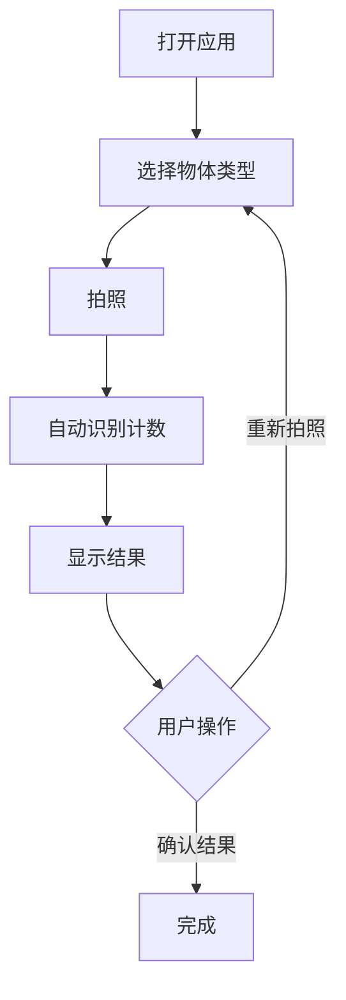

## 1. Product Overview
拍照计数小程序是一款通过拍照自动识别并计数物体数量的工具应用，解决人工计数效率低、易出错的问题。
- 主要功能是通过拍照识别不同类型物体的数量，如钢管、钢筋、纽扣等
- 目标用户为需要进行物品计数的工人、仓库管理员等，提高工作效率

## 2. Core Features

### 2.1 User Roles
| 角色 | 注册方式 | 核心权限 |
|------|---------------------|------------------|
| 普通用户 | 无需注册 | 使用所有计数功能 |

### 2.2 Feature Module
1. **首页**：功能分类导航、拍照计数入口
2. **拍照页面**：相机预览、拍照按钮、物体类型选择
3. **结果页面**：计数结果展示、重新拍照选项

### 2.3 Page Details
| 页面名称 | 模块名称 | 功能描述 |
|-----------|-------------|---------------------|
| 首页 | 导航栏 | 显示应用名称，提供设置入口 |
| 首页 | 广告横幅 | 显示相关广告信息 |
| 首页 | 主要功能区 | 提供拍照数钢管、拍照数钢筋两个主要功能按钮 |
| 首页 | 功能分类 | 展示各种可计数物体的分类图标，如竹签、圆木、方木等 |
| 拍照页面 | 相机预览 | 实时显示相机画面，提供对焦功能 |
| 拍照页面 | 物体类型选择 | 允许用户选择当前要计数的物体类型 |
| 拍照页面 | 拍照按钮 | 触发拍照操作，开始识别计数 |
| 结果页面 | 计数结果 | 显示识别出的物体数量，提供结果确认 |
| 结果页面 | 操作按钮 | 提供重新拍照、保存结果等选项 |

## 3. Core Process
用户打开应用 → 选择要计数的物体类型 → 拍照 → 系统自动识别并计数 → 显示计数结果 → 用户确认或重新拍照

## 4. User Interface Design
### 4.1 Design Style
- 主色调：蓝色系 (#1E40AF)
- 辅助色：白色 (#FFFFFF)、浅灰色 (#F3F4F6)
- 按钮样式：圆角矩形，有轻微阴影
- 字体：无衬线字体，主标题 18px，副标题 16px，正文 14px
- 布局风格：卡片式布局，清晰的视觉层次
- 图标风格：简洁、扁平化，使用线性图标

### 4.2 Page Design Overview
| 页面名称 | 模块名称 | UI元素 |
|-----------|-------------|-------------|
| 首页 | 导航栏 | 蓝色背景，白色文字，应用名称居中 |
| 首页 | 广告横幅 | 蓝色背景，白色文字，右侧有箭头图标 |
| 首页 | 主要功能区 | 两个蓝色大按钮，白色文字，图标+文字组合 |
| 首页 | 功能分类 | 圆形图标，每个图标下方有文字说明，网格布局 |
| 拍照页面 | 相机预览 | 全屏相机画面，顶部有物体类型选择下拉菜单 |
| 拍照页面 | 拍照按钮 | 底部中央的圆形按钮，有轻微的3D效果 |
| 结果页面 | 计数结果 | 大号数字显示，居中布局，下方有物体类型说明 |
| 结果页面 | 操作按钮 | 底部的重新拍照和确认按钮，左右布局 |

### 4.3 Responsiveness
- 移动优先设计，适配不同屏幕尺寸的手机
- 触摸优化，按钮尺寸适合手指点击
- 横屏/竖屏自适应

### 4.4 3D Scene Guidance
- 无3D场景需求