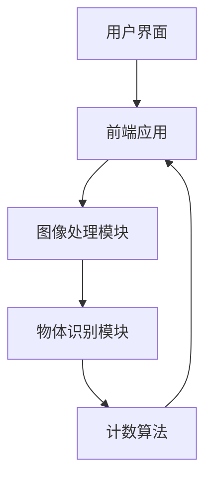

## 1. Architecture Design

## 2. Technology Description
- Frontend: React@18 + tailwindcss@3 + vite
- Initialization Tool: vite-init
- Backend: None (纯前端实现)
- 图像处理: Canvas API
- 物体识别: TensorFlow.js (可选，用于更准确的识别)
- 计数算法: 自定义算法

## 3. Route Definitions
| 路由 | 用途 |
|-------|---------|
| / | 首页，功能分类导航 |
| /capture | 拍照页面 |
| /result | 结果页面 |

## 4. API Definitions
- 无后端API需求，所有功能在前端实现

## 5. Server Architecture Diagram
- 无后端架构

## 6. Data Model
- 无数据库需求，临时数据存储在内存中

### 6.1 数据结构
| 数据结构 | 字段 | 类型 | 描述 |
|-----------|-------------|-------------|-------------|
| 物体类型 | id | string | 物体类型唯一标识 |
| 物体类型 | name | string | 物体类型名称 |
| 物体类型 | icon | string | 物体类型图标URL |
| 计数结果 | count | number | 识别出的物体数量 |
| 计数结果 | type | string | 计数的物体类型 |
| 计数结果 | image | string | 拍摄的图片数据URL |
| 计数结果 | timestamp | number | 计数时间戳 |